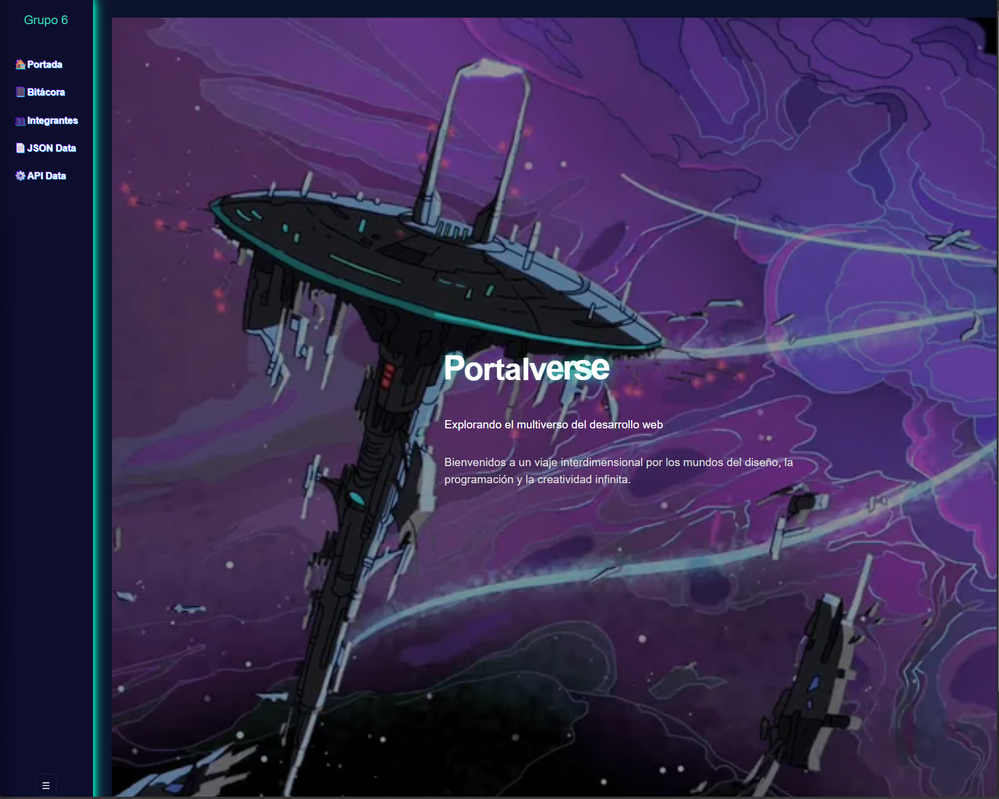
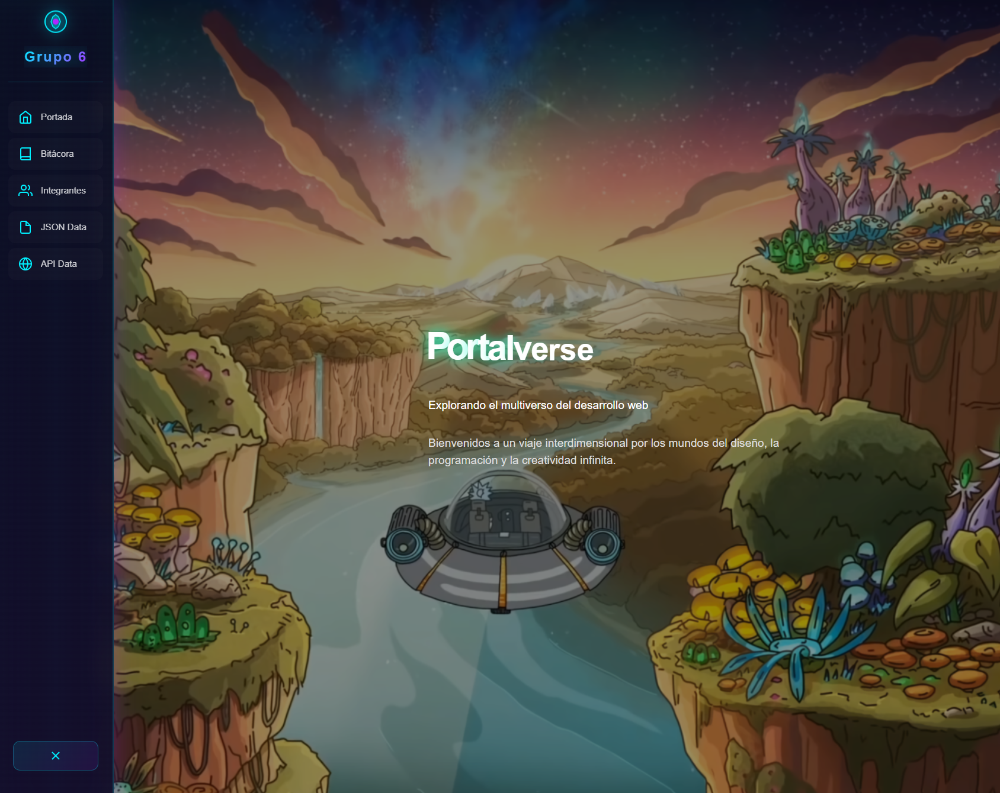
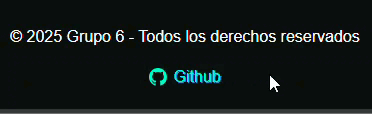
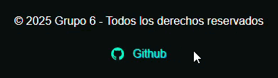
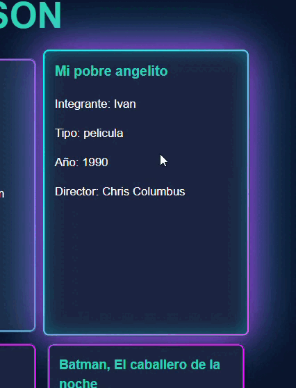
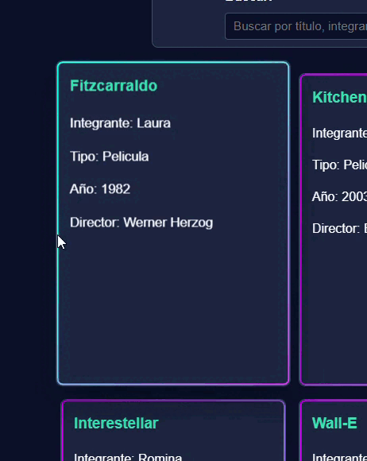
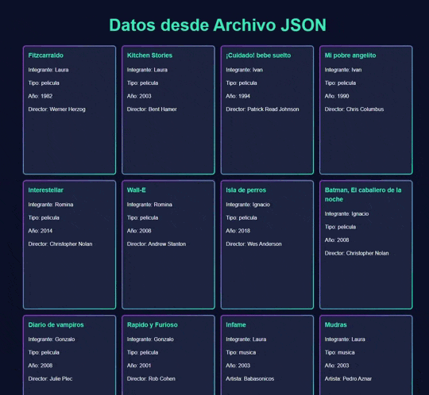
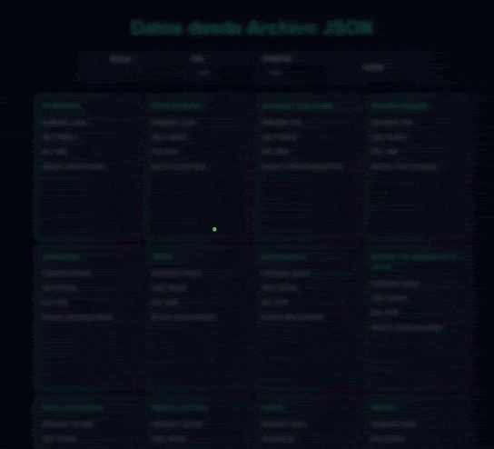
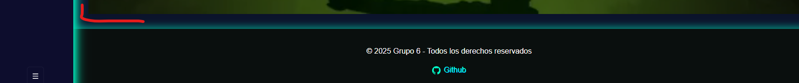
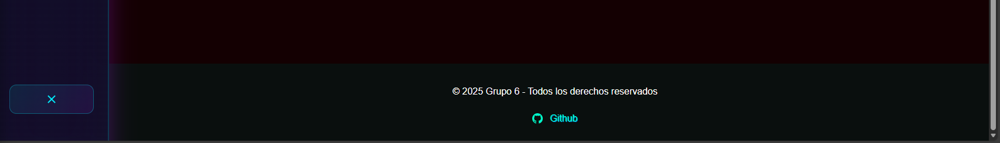

# Proyecto: Portalverse (TP) — Grupo 6

Descripción
-----------
Proyecto SPA desarrollado con React + Vite. Presenta una portada del equipo, páginas individuales por integrante, una bitácora, una sección que consume la API pública de Rick and Morty (personajes) y una sección que muestra datos locales desde un archivo JSON.

Características principales
-------------------------
- SPA con rutas (React Router).
- Sidebar lateral fijo con navegación.
- Portal visual (imagen + anillos animados) que aparece al cambiar de sección.
- Efecto de sonido al abrir el portal (archivo en `public/assets/portal-sound.mp3` o fallback sintetizado).
- Consumo de API Rick and Morty (buscador por nombre) y traducción de campos relevantes al español.
- Datos locales renderizados desde `src/data/data.json`.

Arbol de Renderizado
-----------------------


Estructura del proyecto
-----------------------
```
/ (root)
├─ public/
│  ├─ assets/
│  │  ├─ pic_1.jpg
│  │  ├─ pic_2.png
│  │  ├─ pic_3.jpg
│  │  ├─ pic_4.jpg
│  │  ├─ rickAndMortyPortal.png   # imagen del portal
│  │  └─ portal-sound.mp3        # sonido del portal (opcional)
│  └─ index.html
├─ src/
│  ├─ main.jsx
│  ├─ App.jsx
│  ├─ styles/
│  │  ├─ App.css
│  │  └─ index.css
│  ├─ components/
│  │  ├─ Sidebar.jsx
│  │  ├─ Sidebar.css
│  │  ├─ Footer.jsx
│  │  ├─ Footer.css
│  │  ├─ Portal.jsx
│  │  └─ Card.jsx
│  ├─ pages/
│  │  ├─ portada/Portada.jsx
│  │  ├─ portada/Portada.css
│  │  ├─ integrantes/Integrantes.jsx
│  │  ├─ integrantes/Integrantes.css
│  │  ├─ Bitacora.jsx
│  │  ├─ Bitacora.css
│  │  ├─ APIData.jsx
│  │  ├─ APIData.css
│  │  ├─ JSONData.jsx
│  │  └─ JSONData.css
│  ├─ hooks/
│  │  └─ useFetch.js
│  ├─ services/
│  │  └─ rickAndMorty.js
│  ├─ utils/
│  │  └─ translate.js
│  └─ data/
│     └─ data.json
├─ package.json
└─ vite.config.js
```

Cómo ejecutar (desarrollo)
-------------------------
Desde la raíz del proyecto:

```bash
npm install
npm run dev
```

Abre el navegador en la URL que indique Vite (por defecto `http://localhost:5173`).

Build de producción
-------------------
```bash
npm run build
npm run preview
```

Rutas disponibles
-----------------
- `/` → Portada (index.html en la raíz)
- `/bitacora` → Bitácora del proyecto
- `/integrantes` → Páginas de integrantes (vínculos desde la portada)
- `/api-data` → Sección que consume la API de Rick and Morty (buscador por nombre)
- `/json-data` → Datos leídos desde `src/data/data.json`

---

# Mejoras Implementadas (Tercera Entrega)

Este documento detalla las 5 mejoras principales implementadas entre la segunda y tercera entrega del proyecto, enfocadas en mejoras visuales, animaciones y experiencia de usuario.

---

## Mejora 1: Sidebar Mejorado con Iconos SVG y Animaciones

### Descripción
Se rediseñó completamente el Sidebar reemplazando los emojis simples por iconos SVG personalizados creados en el componente `Icons.jsx`. Se implementaron múltiples mejoras visuales:
- Logo animado con gradientes y efecto de flotación (`float`)
- Iconos SVG personalizados para cada sección (Home, Book, Users, File, API)
- Efectos hover mejorados con transformaciones, cambios de color y sombras
- Transiciones suaves con `cubic-bezier` para mejor fluidez
- Efecto shimmer en el fondo del sidebar
- Mejor manejo del estado colapsado con transiciones más fluidas
- Botón toggle mejorado con iconos SVG (Menu/Close) en lugar de texto

### Antes
La segunda entrega usaba emojis simples (🏠, 📔, 👥, 📄, ⚙️) para los iconos del sidebar, con animaciones básicas de glitch y efectos visuales limitados.

### Después
La tercera entrega presenta un sidebar más profesional con iconos SVG vectoriales, logo animado, gradientes modernos y transiciones suaves que mejoran significativamente la experiencia visual.

**Captura de pantalla - Antes:**


**Captura de pantalla - Después:**


---

## Mejora 2: Botones de Redes Sociales Animados

### Descripción
Se implementaron animaciones avanzadas en el botón de GitHub del Footer:
- Efectos hover con escalado y rotación del icono (`scale(1.2) rotate(6deg)`)
- Animación de click (`github-pop`) con efecto de rebote
- Cambios de color suaves durante las interacciones
- Transformación del texto al hacer hover (`translateX(4px)`)
- Drop shadows animados que responden a las interacciones
- Soporte para accesibilidad con eventos de teclado

### Antes
La segunda entrega tenía un enlace simple de GitHub sin animaciones, solo con transición básica de color.

### Después
La tercera entrega incluye un botón interactivo con múltiples animaciones que proporcionan feedback visual claro al usuario, mejorando la experiencia de interacción.

**Captura de pantalla - Antes:**



**Captura de pantalla - Después:**



---

## Mejora 3: Transiciones Suaves en Tarjetas (Cards)

### Descripción
Se mejoraron significativamente las transiciones y efectos hover de las tarjetas en toda la aplicación:
- Transiciones optimizadas con `cubic-bezier(.2,.9,.3,1)` para movimientos más naturales
- Efectos hover mejorados con `translateY(-8px) scale(1.04)` y sombras dinámicas
- Optimización de rendimiento con `will-change` y `backface-visibility: hidden`
- Sombras multicapa que se intensifican al hacer hover
- Soporte para `prefers-reduced-motion` para accesibilidad
- Transiciones más rápidas (220ms) para mejor respuesta

### Antes
La segunda entrega tenía transiciones básicas en las tarjetas sin optimización de rendimiento ni efectos hover avanzados.

### Después
La tercera entrega presenta tarjetas con animaciones fluidas y profesionales que mejoran la percepción de calidad de la interfaz.

**Captura de pantalla - Antes:**



**Captura de pantalla - Después:**



---

## Mejora 4: Mejoras Visuales en el Portal de Transición

### Descripción
Se mejoraron los efectos visuales del portal que aparece durante las transiciones entre páginas:
- Mejor `backdrop-filter` con blur y brightness para el overlay
- Animación mejorada del mensaje del portal (`portal-message-in`) con escalado y movimiento
- Transiciones más suaves en el contenido de fondo durante la apertura del portal
- Mejor integración visual con el resto de la interfaz
- Efectos de desenfoque más pronunciados para mayor impacto visual

### Antes
La segunda entrega tenía un overlay básico sin efectos de blur avanzados y animaciones más simples.

### Después
La tercera entrega presenta un portal con efectos visuales más sofisticados que crean una experiencia de transición más inmersiva.

**Captura de pantalla - Antes:**



**Captura de pantalla - Después:**



---

## Mejora 5: Ajustes Visuales y Transiciones en Portada

### Descripción
Se realizaron mejoras sutiles pero importantes en la página de Portada:
- Ajustes en el `portada-wrapper` con márgenes negativos para mejor visualización
- Transiciones más fluidas en el cambio de fondos
- Mejores ajustes responsive para diferentes tamaños de pantalla
- Optimización del overlay para mejor legibilidad del texto
- Mejores transiciones CSS con variables CSS para consistencia

### Antes
La segunda entrega tenía una portada funcional pero con ajustes visuales básicos y menos refinamiento en las transiciones.

### Después
La tercera entrega presenta una portada más pulida con transiciones suaves y mejor integración visual con el resto de la aplicación.

**Captura de pantalla - Antes:**


**Captura de pantalla - Después:**


---

## Resumen de Componentes y Mejoras

Los siguientes componentes y mejoras fueron implementados:

- `src/components/Icons.jsx` - Componente con iconos SVG personalizados (Logo, Home, Book, Users, File, API, Menu, Close)
- `src/components/SideBar.jsx` - Sidebar rediseñado con iconos SVG y animaciones mejoradas
- `src/components/Footer.jsx` - Footer con botones de redes sociales animados
- Mejoras en `src/styles/App.css` - Transiciones optimizadas para tarjetas
- Mejoras en `src/styles/SideBar.css` - Estilos avanzados con gradientes y animaciones
- Mejoras en `src/styles/Footer.css` - Animaciones para botones sociales
